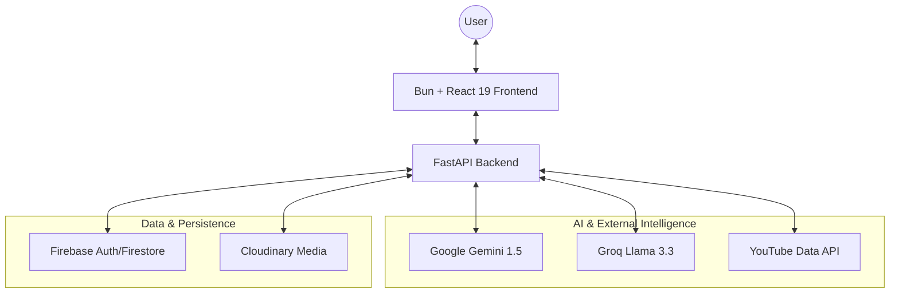

# 🏗️ Kartr Technical Architecture

This document provides a deep dive into the engineering principles and system design of Kartr.

## 📌 High-Level Design

Kartr follows a **Decoupled Client-Server Architecture** with an emphasis on asynchronous processing to handle heavy AI workloads without blocking the user interface.

## 🚀 Key Technical Decisions

### 1. Bun Runtime (Frontend)
- **Why?**: Bun provides significantly faster install times and a built-in bundler/test runner that outperforms traditional Node.js/Vite setups. It aligns with Kartr's focus on velocity.

### 2. FastAPI (Backend)
- **Why?**: Python is the language of AI. FastAPI allows us to leverage modern async/await patterns, ensuring that long-running tasks like video analysis don't block other API requests.

### 3. Google Gemini + Groq (Hybrid AI)
- **Why?**: 
    - **Gemini** excels at large-context window tasks (processing long transcripts).
    - **Groq** (via Llama 3.3) provides ultra-fast inference for prompt enhancement and chat interactions.

### 4. Bipartite Relationship Mapping
- **Why?**: Traditional lists don't capture the "fit" between a creator and a brand. By using **NetworkX** to generate bipartite graphs, we can visualize complex ecosystems and calculate affinity scores mathematically.

## 🔄 Data Flow: Campaign Analysis

1. **User Input**: A sponsor pastes a YouTube URL.
2. **Metadata Fetch**: Backend uses `google-api-python-client` to pull video snippets and transcripts.
3. **AI Extraction**: The transcript is piped to Gemini with a custom system prompt to identify sponsors, sentiment, and niche.
4. **Knowledge Graph**: The extracted entities are added to a NetworkX graph to find correlations with existing sponsors.
5. **Real-time Feedback**: The results are pushed to the React frontend and cached in Firebase for the campaign dashboard.

---

## 🔒 Security & Performance

- **Auth**: JWT-based session management linked with Firebase Authentication.
- **CORS**: Strict origin validation to protect the analytical endpoints.
- **Caching**: Intelligent caching of YouTube metadata to stay within API rate limits.
